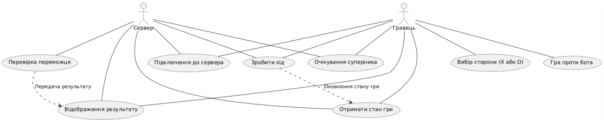

# Функціональні вимоги

## 1. Запуск гри

| №  | Функція                    | Опис |
|----|----------------------------|------|
| 1  | Створення гри              | Гравець запускає сервер і очікує підключення другого гравця. |
| 2  | Підключення до гри         | Гравець вводить IP сервера та підключається як клієнт. |
| 3  | Відображення ігрового поля | Після успішного підключення гравці бачать поле 3×3. |

## 2. Процес гри

| №  | Функція                          | Опис                                                             |
|----|----------------------------------|------------------------------------------------------------------|
| 4  | Початок гри                      | Гра стартує автоматично після підключення двох гравців.          |
| 5  | Визначення першого ходу          | Система випадково вибирає, хто ходить першим.                    |
| 6  | Введення ходу                    | Гравці вводять координати шляхом натискання миші.                |
| 7  | Перевірка коректності ходу       | Система перевіряє, чи клітинка вільна.                           |
| 8  | Оновлення ігрового поля          | Сервер оновлює поле після кожного ходу та надсилає його гравцям. |
| 9  | Перевірка переможця              | Система визначає, чи є переможець або нічия.                     |

## 3. Завершення гри

| №  | Функція                          | Опис                                                                                                              |
|----|----------------------------------|-------------------------------------------------------------------------------------------------------------------|
| 10 | Повідомлення про перемогу        | Якщо хтось виграв, система виводить повідомлення: `"Гра закінчена", "Гравець X/O переміг!"`.                      |
| 11 | Повідомлення про нічию           | Якщо всі клітинки заповнені, гра завершується нічиєю, система виводить повідомлення: `"Гра закінчена", "Нічия!"`. |
| 12 | Пропозиція зіграти ще раз        | Після завершення гри система запитує, чи хочуть гравці повторити гру.                                             |

## 4. Обробка підключення

| №  | Функція                          | Опис                                                                                                         |
|----|----------------------------------|--------------------------------------------------------------------------------------------------------------|
| 13 | Очікування підключення           | Сервер може чекати підключення гравця необмежений час.                                                       |
| 14 | Обробка помилок підключення      | Якщо клієнт не може підключитися, програма видає відповідне повідомлення.                                    |
| 15 | Втрата підключення               | Якщо один із гравців виходить, гра завершується з повідомленням: `"Гра закінчена", "Противник покинув гру"`. |

# Модулі програми
## Логіка гри:
- Валідація ходів.
- Перевірка переможця після кожного ходу.
- Фіксація нічиєї.
- Збереження стану ігрового поля.
## Інтерфейс:
- Бібліотеки **Tkinter** або **Pygame** для графічного представлення.
- Створення головного вікна гри.
- Додавання назви гри у заголовок.
- Відображення ігрового поля (сітка 3x3).
- Реагування на кліки мишкою по комірках.
- Відображення хрестиків і нуликів у відповідних місцях
- Підсвічування переможної комбінації.
- Відображення статусу гри
- Кнопка "Нова гра" для перезапуску.
- обробка кліків мишкою для введення ходів.
## Клієнт:
- Підключення до сервера через сокети.
- Відправка ходів та отримання оновленого стану гри.
- Інтеграція мережевої взаємодії з графічним інтерфейсом.
- Відображення отриманих ходів від другого гравця.
## Сервер:
- Запуск сервера, який приймає підключення двох гравців.
- Управління чергою ходів.
- Відправка оновленого стану гри обом гравцям.
- Обробка розриву з'єднання.

# Use Case Diagram

@startuml
actor Гравець
actor Сервер

usecase "Підключення до сервера" as UC1
usecase "Вибір сторони (X або O)" as UC2
usecase "Очікування суперника" as UC3
usecase "Зробити хід" as UC4
usecase "Отримати стан гри" as UC5
usecase "Перевірка переможця" as UC6
usecase "Відображення результату" as UC7
usecase "Гра проти бота" as UC8

Гравець -- UC1
Гравець -- UC2
Гравець -- UC3
Гравець -- UC4
Гравець -- UC5
Гравець -- UC7
Гравець -- UC8

Сервер -- UC1
Сервер -- UC3
Сервер -- UC4
Сервер -- UC5
Сервер -- UC6
Сервер -- UC7

UC6 ..> UC7 : "Передача результату"
UC4 ..> UC5 : "Оновлення стану гри"

@enduml

